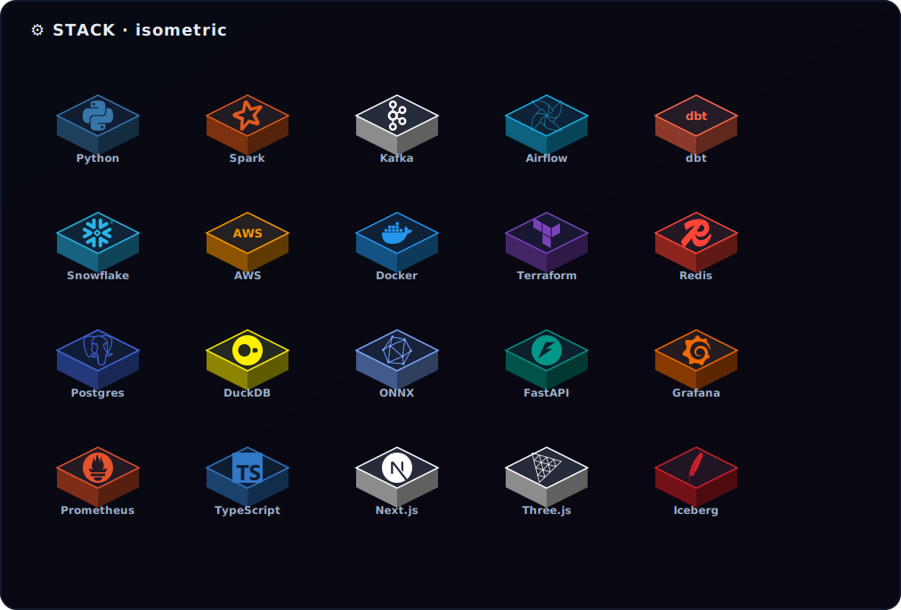

<!-- ░░░░░░░░░░░░░░░░░░░░░░░░░░░░░  HERO  ░░░░░░░░░░░░░░░░░░░░░░░░░░░░░ -->

 

  

<!-- ░░░░░░░░░░░░░░░░░░░░░░░░░░░░░  INTRO  ░░░░░░░░░░░░░░░░░░░░░░░░░░░░░ -->
 

> 👋 I'm **Sathvik** — a senior data engineer with five years building real-time pipelines and lakehouses on AWS for financial services and healthcare. I care about one thing above all: shrinking the latency between an **event** happening and the **decision** it should trigger. Every project below is **open-source and reproducible from a single `make` command.**

<!-- ░░░░░░░░░░░░░░░░░░░░░░░░░░░░░  LIVE PIPELINE  ░░░░░░░░░░░░░░░░░░░░░░░░░░░░░ -->
## 🛰️ The system I build, end to end

**ingest → event spine → compute → lakehouse → serve** — watch the data flow through it.

<!-- ░░░░░░░░░░░░░░░░░░░░░░░░░░░░░  3D STACK  ░░░░░░░░░░░░░░░░░░░░░░░░░░░░░ -->
## 🧊 My stack, in three dimensions

<!-- ░░░░░░░░░░░░░░░░░░░░░░░░░░░░░  PROJECTS  ░░░░░░░░░░░░░░░░░░░░░░░░░░░░░ -->
## 🚀 Featured Projects — deep dive

<table>
<tr>
<td width="50%" align="center">

</td>
<td width="50%" align="center">

</td>
</tr>
<tr>
<td width="50%" align="center">

</td>
<td width="50%" align="center">

</td>
</tr>
</table>

### ⚡ [fraud-streaming](https://github.com/sathvikreddyp061-collab/fraud-streaming) &nbsp;·&nbsp; sub-second risk on a 5K event/sec spine

> Re-platformed a batch-heavy risk surface into an event-native lakehouse. Card-auth events hit Kafka under strict Avro contracts; PySpark Structured Streaming joins each against a Redis feature store and scores with XGBoost→ONNX — **P99 inference under 1 ms**, well inside the 250 ms decisioning budget.

`Kafka (Redpanda) + Avro → PySpark Structured Streaming ⇄ Redis features → XGBoost/ONNX → Iceberg silver · alerts topic · FastAPI`

### 🔄 [retail-cdc](https://github.com/sathvikreddyp061-collab/retail-cdc) &nbsp;·&nbsp; exactly-once change data capture

> Postgres logical decoding → Debezium → Kafka → Spark/Iceberg → dbt → a custom reverse-ETL worker. The **outbox pattern + content-hash idempotency** proves producer-side exactly-once: 76,533 webhook POSTs on first run, **zero on rerun**.

`PostgreSQL 16 → Debezium 2.6 → Kafka → PySpark → Iceberg → dbt-DuckDB → content-hash reverse-ETL → mock Segment`

### 🏥 [claims-lakehouse](https://github.com/sathvikreddyp061-collab/claims-lakehouse) &nbsp;·&nbsp; HIPAA-flavored claims lakehouse

> Synthetic patients (Synthea) and a hand-written **X12 EDI 837 writer + parser** flow through Kafka into Iceberg, transform via dbt-DuckDB, pass Great Expectations gates, get SHA-256 PII masking, and land as a Member-360 mart — all orchestrated by Airflow.

`Synthea + EDI 837 → Kafka → PySpark Iceberg → dbt-DuckDB → Great Expectations → hipaa_mask → Member 360 → Airflow`

### 🎨 [portfolio](https://github.com/sathvikreddyp061-collab/portfolio) &nbsp;·&nbsp; the cinematic front door

> A 3D, WebGL personal site that makes the work above tangible. `Next.js App Router · React Three Fiber · custom GLSL particle shaders · Framer Motion · Lenis` — **[live ↗](https://portfolio-fawn-beta-zjvbplk2vx.vercel.app)**

<!-- ░░░░░░░░░░░░░░░░░░░░░░░░░░░░░  STATS  ░░░░░░░░░░░░░░░░░░░░░░░░░░░░░ -->
## 📊 GitHub Activity

&nbsp;

  

<!-- ░░░░░░░░░░░░░░░░░░░░░░░░░░░░░  FOOTER  ░░░░░░░░░░░░░░░░░░░░░░░░░░░░░ -->
## 💬 Let's talk

Want a walkthrough of any pipeline? Reach out.

