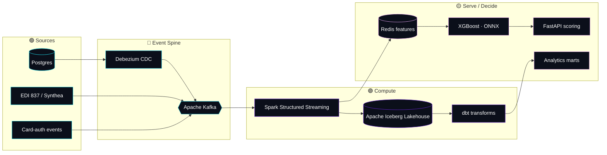

<!-- ░░░░░░░░░░░░░░░░░░░░░░░░░░░░░  HERO  ░░░░░░░░░░░░░░░░░░░░░░░░░░░░░ -->

 

  

<!-- ░░░░░░░░░░░░░░░░░░░░░░░░░░░░░  INTRO  ░░░░░░░░░░░░░░░░░░░░░░░░░░░░░ -->
 

> 👋 I'm **Sathvik** — a senior data engineer with five years building real-time pipelines and lakehouses on AWS for financial services and healthcare. I care about one thing above all: shrinking the latency between an **event** happening and the **decision** it should trigger.

  

<!-- ░░░░░░░░░░░░░░░░░░░░░░░░░░░░░  ARCHITECTURE  ░░░░░░░░░░░░░░░░░░░░░░░░░░░░░ -->
## 🗺️ How I think about data systems

<!-- ░░░░░░░░░░░░░░░░░░░░░░░░░░░░░  PROJECTS  ░░░░░░░░░░░░░░░░░░░░░░░░░░░░░ -->
## 🚀 Featured Projects

<table>
<tr>
<td width="50%" align="center">

</td>
<td width="50%" align="center">

</td>
</tr>
<tr>
<td width="50%" align="center">

</td>
<td width="50%" align="center">

</td>
</tr>
</table>

- ⚡ **[fraud-streaming](https://github.com/sathvikreddyp061-collab/fraud-streaming)** — sub-250ms card-auth fraud scoring on a 5K eps stream. `Kafka → Spark → Redis → XGBoost (ONNX) → Iceberg + FastAPI`
- 🔄 **[retail-cdc](https://github.com/sathvikreddyp061-collab/retail-cdc)** — exactly-once CDC via outbox + content-hash. `Postgres → Debezium → Kafka → Spark/Iceberg → dbt → reverse-ETL`
- 🏥 **[claims-lakehouse](https://github.com/sathvikreddyp061-collab/claims-lakehouse)** — HIPAA-flavored claims lakehouse. `Synthea + EDI 837 → Kafka → PySpark Iceberg → dbt → Great Expectations → Airflow`
- 🎨 **[portfolio](https://github.com/sathvikreddyp061-collab/portfolio)** — cinematic 3D site. `Next.js · React Three Fiber · GLSL shaders · Framer Motion` · **[Live ↗](https://portfolio-fawn-beta-zjvbplk2vx.vercel.app)**

<!-- ░░░░░░░░░░░░░░░░░░░░░░░░░░░░░  STACK  ░░░░░░░░░░░░░░░░░░░░░░░░░░░░░ -->
## 🧰 Tech I work with

| Layer | Tools |
|:--|:--|
| **Languages** |    |
| **Streaming** |    |
| **Lakehouse** |     |
| **Warehouse** |   |
| **Orchestration** |   |
| **AI / ML** |     |
| **Infra** |      |

<!-- ░░░░░░░░░░░░░░░░░░░░░░░░░░░░░  STATS  ░░░░░░░░░░░░░░░░░░░░░░░░░░░░░ -->
## 📊 GitHub Activity

&nbsp;

  

 

<!-- ░░░░░░░░░░░░░░░░░░░░░░░░░░░░░  FOOTER  ░░░░░░░░░░░░░░░░░░░░░░░░░░░░░ -->
## 💬 Let's talk

Open to senior data engineering roles — remote · hybrid · on-site. Want a walkthrough of any pipeline? Reach out.

<!-- profile readme -->
